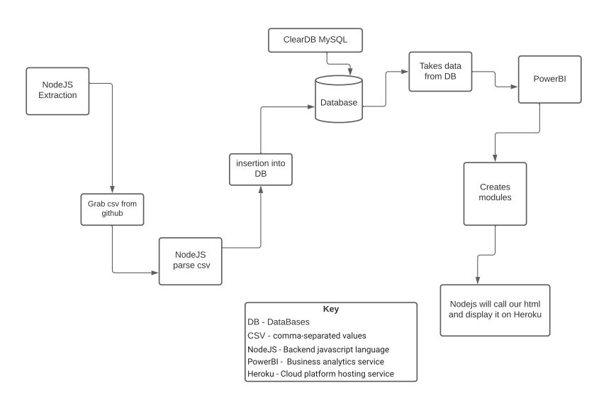
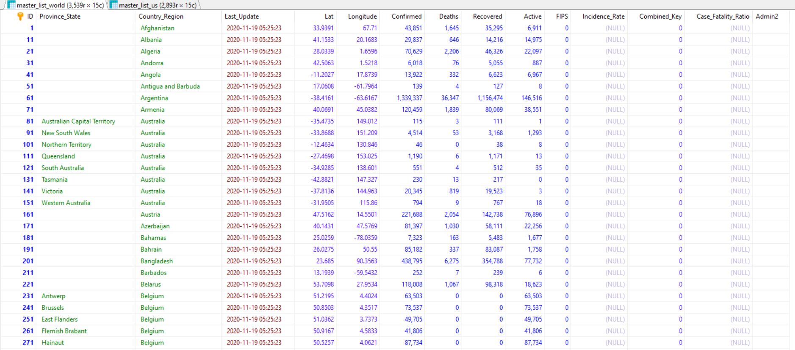
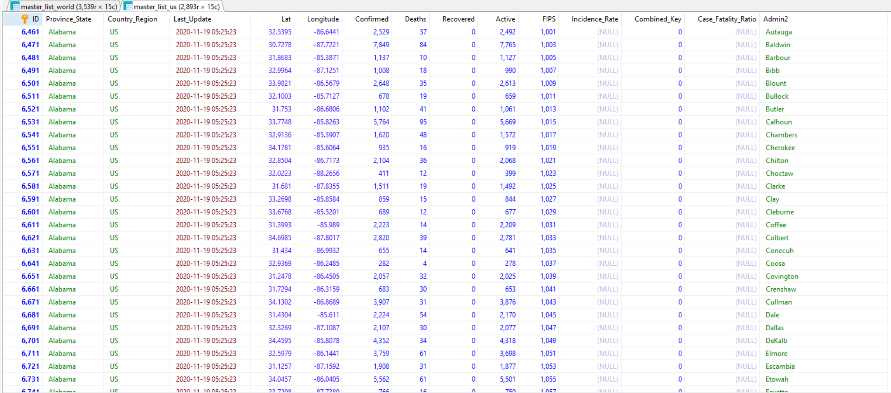
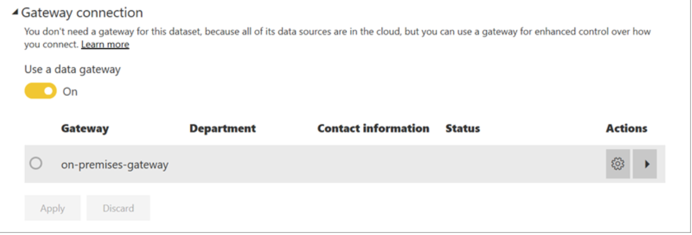
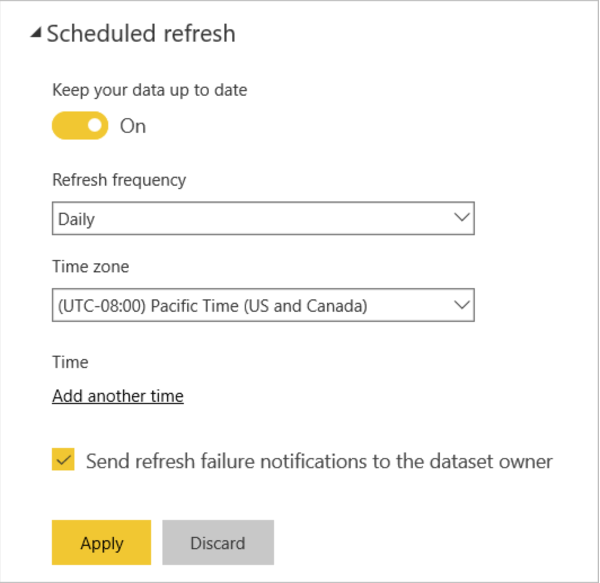
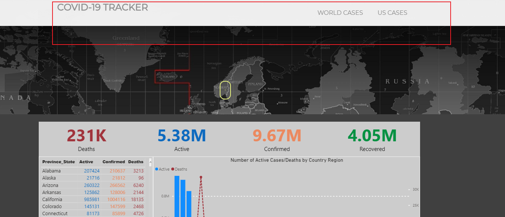
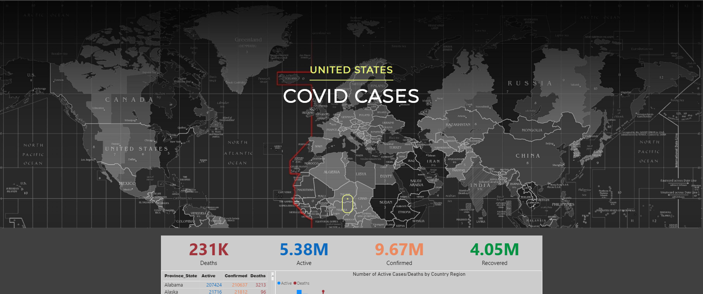

## Covid-19 Tracker

 
<h4 align="center">UML Diagram</h4>

### Data Retrieval (Chris)

Our data source for this project is the CSSEGIS data repository located here:
<a href="https://github.com/CSSEGISandData/COVID-19">https://github.com/CSSEGISandData/COVID-19</a>
 
Our node.js server fetches the new data daily, parses it, and inserts it into our database as a job run with heroku scheduler.

Additionally, the web app is served through a nodejs server on our heroku dynamo.

<h4 align="center">This scheduler runs our daily update</h4>

### Database (Devan)

 
For this project we are using a clear-db mysql query language. This database is hosted on Heroku and we are using it to hold two of our tables. The first table holds our world covid data and our second table holds US covid data.

 Below is example screenshots of what our data looks like in the two tables:

<h4 align="center">World Covid Data</h4>

<h4 align="center">US Covid Data</h4>

### PowerBI (Brandon)
<h4 align = "center">PowerBI Intro - Data Connection and Overview</h4>

Once the database is set and populated, we are able to utilize Microsoft's PowerBI Software (PowerBI) to create the visuals for our site. PowerBI is a data visualization software that builds visuals from various data sources I.E. Excel and SQL. 

The Visuals available in PowerBI,(I.E. Bar Graphs, Tables, Gantt charts), serve as templates with fields that stand as the holding place for the database columns to be pulled over. Once the columns are placed to the templates columns into the visual templates, the software then builds the visuals using the provided data located in the columns. Further Modifications and customizations can be made by altering the queries that refresh the data as it comes in. THis is done through the inherent PowerQuery Editor that is shared between multiple Microsoft products (Excel). PowerBI is a one-stop-shop for data visualization and manipulation. 

<h4 align = "center">PowerBI - Published Reports</h4>

PowerBI offers a platform for individuals to share reports by allowing the user to create a shared workspace. Through these shared workspaces, users, collaborators, and members can manage the published reports. For this specific project, out team utilized the embedded approach to sharing our content. Once the visuals are created in the PowerBI Desktop Applicaiton, the next step is to publish to our team's workspace. From there we utilized the embedded report option. This option allows for the creation of iframe code that we use to directly place into our node.js project hosted on heroku. Here is an example of the embedded code created through PowerBI: 

<iframe width="1024" height="612" src="https://app.powerbi.com/view?r=eyJrIjoiZWRjZGE0ZTEtMTc3ZC00Zjg3LTk2MzUtNTUxMWI1NzY2NTNhIiwidCI6ImIyNGVlN2JjLTZhNGEtNGU0Ny1hYmM3LTcyMDdjMDAzYTdkMyJ9" frameborder="0" allowFullScreen="true"></iframe>

<h4 align = "center">PowerBI - Data Refresh</h4>

In order for PowerBI to refresh the data for our exiting reports the PowerBI service utilizes an 'On Premise Data Gateway'. What the gateway does is allow for a bridge to connect data that isn't stored in PowerBI's cloud (dataset stored with every publish to PowerBI's workspace), and data that exists in PowerBI's cloud, (Published dataset to the workspace). The Gateway software was downloaded to my specific desktop. In part my personal desktop was turned into our private server for this project. Everyday PowerBI would run the gateway downloaded on my desktop to pull the data from our database to PowerBI's cloud. Please see the screen shot below for a snap of the gateway connection used for this project. 
 

In order to keep the reports refreshed on the PowerBI side, our team utilized the inherenet refresh property of PowerBI's published datasets/reports. This property allowed for the scheduling of a periodic refresh that pings our ClearDB database to send the refreshed data to our PowerBI workspace. From there PowerBI replaces the stored data from the previous refresh with the new and updates our existing visuals with the new rows of data. See below for a snap shot of the scheduled refresh settings through Power BI.

### Heroku 
#### What is Heroku?
Heroku is cloud platform service allowing you to host web applications with multiple different programming language options.

Allowing us to host our website server using node.js and display our information in html/css.

#### Website Features
##### World Covid Cases

##### Navigation Bar (Scroll to use)

##### US Covid Cases

#### [Link to Covid-19 Tracker Page](https://powerful-temple-05417.herokuapp.com/)

### Key Terms
1. **DB** - Database
2. **CSV** - Comma-seperated values
3. **NodeJS** - Backend javascript language
4. **PowerBI** - Business analytics service
5. **Heroku** - Cloud platform hosting service
