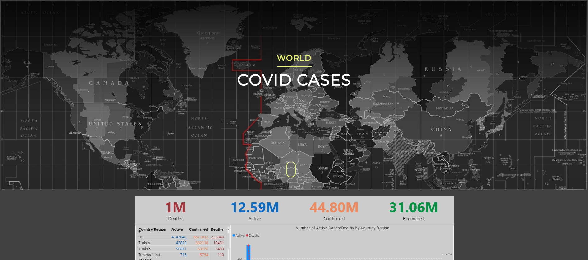

## Covid-19 Tracker

 
<h4 align="center">UML Diagram</h4>

### Data Retrieval (Chris)

Our data source for this project is the CSSEGIS data repository located here:
<a href="https://github.com/CSSEGISandData/COVID-19">https://github.com/CSSEGISandData/COVID-19</a>
 
Our node.js server fetches the new data daily, parses it, and inserts it into our database as a job run with heroku scheduler.

Additionally, the web app is served through a nodejs server on our heroku dynamo.

<h4 align="center">This scheduler runs our daily update</h4>

### Database (Devan)

 
For this project we are using a clear-db mysql query language. This database is hosted on Heroku and we are using it to hold two of our tables. The first table holds our world covid data and our second table holds US covid data.

 Below is example screenshots of what our data looks like in the two tables:

<h4 align="center">World Covid Data</h4>

<h4 align="center">US Covid Data</h4>

### PowerBI (Brandon)
<h4 align = "center">PowerBI Intro - Data Connection and Overview</h4>

Once the database is set and populated, we are able to utilize Microsoft's PowerBI Software (PowerBI) to create the visuals for our site. PowerBI is a data visualization software that builds visuals from various data sources I.E. Excel and SQL. 

The Visuals available in PowerBI,(I.E. Bar Graphs, Tables, Gantt charts), serve as templates with fields that stand as the holding place for the database columns to be pulled over. Once the columns are placed to the templates columns into the visual templates, the software then builds the visuals using the provided data located in the columns. Further Modifications and customizations can be made by altering the queries that refresh the data as it comes in. THis is done through the inherent PowerQuery Editor that is shared between multiple Microsoft products (Excel). PowerBI is a one-stop-shop for data visualization and manipulation. 

<h4 align = "center">PowerBI - Published Reports</h4>

<h4 align = "center">PowerBI - Data Refresh</h4>

### Heroku 
#### What is Heroku?
Heroku is cloud platform service allowing you to host multiple different programming languages.

Allowing us to host our website server using node.js and display our information in html/css.

#### Website Features
##### World Covid Cases

##### Navigation Bar (Scroll to use)

##### US Covid Cases

#### [Link to Covid-19 Tracker Page](https://powerful-temple-05417.herokuapp.com/)

### Key Terms
1. **DB** - Database
2. **CSV** - Comma-seperated values
3. **NodeJS** - Backend javascript language
4. **PowerBI** - Business analytics service
5. **Heroku** - Cloud platform hosting service
